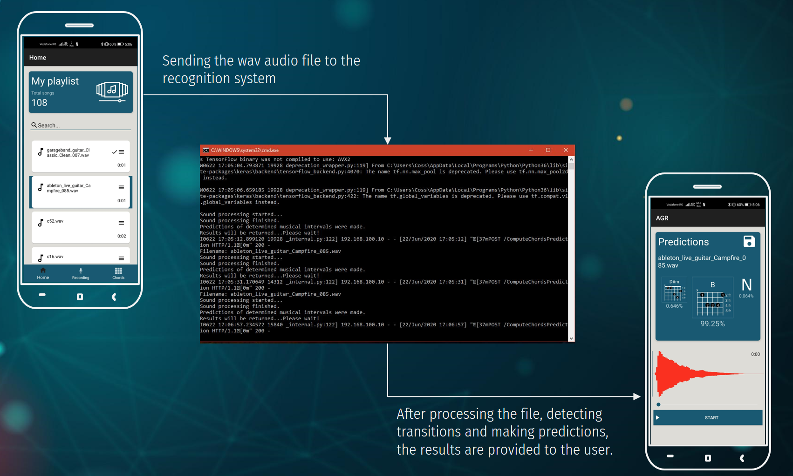
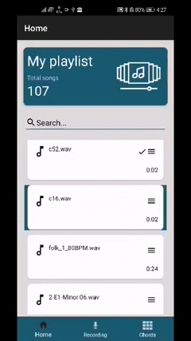

# Automatic recognition of acoustic musical chords

## Table of contents
* [Description](#Description)
* [Technologies](#Technologies)
* [Visuals](#Visuals)

## Description 
The past few years have brought a significant **increase in interest for acoustic music**, closely
related to the parallel evolution of technology globally, with focus on social networks and video
streaming.

It was found that the evolution determined a distance between performers and the musical
sheet, as the process of learning through online tutorials has become much easier. Also, the
classical sheet is a musical element with high difficulty, being necessary to know some notions
of music theory for a full understanding. Therefore, it proved necessary to use a simple and
suggestive notation, specific to acoustic music, namely **musical tabulature**.

Given the existence of these limitations and the desire of guitarists, one solution would
be the **existence of a platform through which acoustic parts can be transcribed automatically,
directly into a tabular representation, using guitar chords**.

The first step of the automatic chord recognition system (ACR) is to apply a **sound processing
method**, in order to extract important musical features, by using a suitable representation in
the field, namely **chromagram**. This first step is a vital one in the analysis of a musical sample,
as obtaining a correct representation is closely related to the continuous development of the
system.

The second part defines the algorithms that underlie the learning processes and differentiate
the features of some chords from a musical sample, specifically, **machine learning algorithms**.
The goal is to gradually arrive at a complex and up-to-date machine learning algorithm, able
to automatically and independently analyze the audio signal and to classify with high precision
each sequence within an acoustic sample.

In order to highlight the good functioning of the ACR, **the system will be connected with
a mobile application**, intended for acoustic music enthusiasts. The application will be able to
display, in real time, **the results of the automatic recognition of acoustic musical chords**, for
any desired musical sheet.

## Technologies
- Kotlin 1.3.7
- Python 3.6.2
- TensorFlow 1.14.0
- Keras 2.3.1
- Librosa 0.7.2

## Visuals
In the image below, it can be seen how the mobile platform is communicating with the recognition system.
The user is selecting the audio recording, which is send to the recognition system (represented by cmd terminal).
Then, the user is waiting the result, and after the automatic recognition process is done, the result are 
provided to the user, and represented in the form of musical tabulatures.

### Demo 

